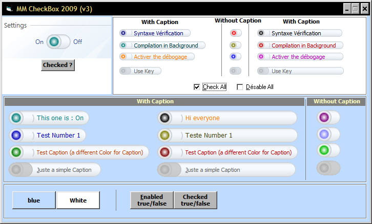

## MM CheckBox 2009 V3 Final

### Description

Final Version of My MM CheckBox 2009 (now, with beautiful Caption if you want)+Code Optimization. (see the screen capture)
 
### More Info
 

             |
---                |---
**Submitted On**   |2009-02-05 19:52:06
**By**             |[Simo Simo](https://github.com/Planet-Source-Code/PSCIndex/blob/master/ByAuthor/simo-simo.md)
**Level**          |Advanced
**User Rating**    |4.9 (44 globes from 9 users)
**Compatibility**  |VB 6\.0
**Category**       |[Custom Controls/ Forms/  Menus](https://github.com/Planet-Source-Code/PSCIndex/blob/master/ByCategory/custom-controls-forms-menus__1-4.md)
**World**          |[Visual Basic](https://github.com/Planet-Source-Code/PSCIndex/blob/master/ByWorld/visual-basic.md)
**Archive File**   |[MM\_CheckBo214306272009\.zip](https://github.com/Planet-Source-Code/simo-simo-mm-checkbox-2009-v3-final__1-71734/archive/master.zip)

